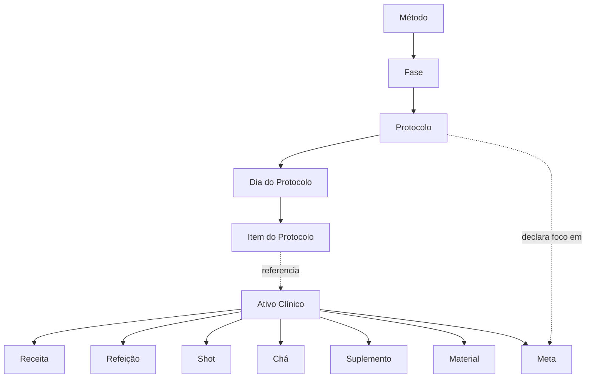
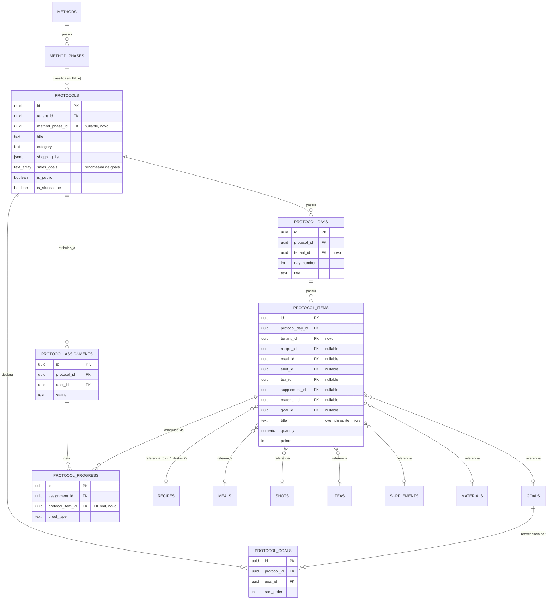
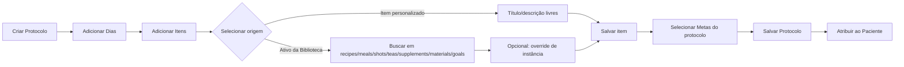

# Arquitetura da Sub-fase 3 — Protocolos

**Status:** Em revisão (nenhum código implementado)
**Data:** 2026-07-21
**Escopo deste documento:** modelagem e validação arquitetural apenas. Nenhuma migração, hook, rota ou tela foi criada a partir deste documento — isso só acontece após aprovação explícita, PR a PR, conforme o plano de implementação na Seção 9.

---

## 0. Achados de investigação (fatos verificados no código atual, antes de qualquer decisão de design)

Antes de desenhar o modelo novo, foi necessário entender exatamente o que existe hoje. Os fatos abaixo mudam algumas suposições do planejamento original e **acrescentam um achado novo e relevante**.

### 0.1 Há hoje três consumidores de "conteúdo de protocolo", não dois

1. **`ProtocolsView.tsx` (aba "Protocolos", tela principal, viva)** — lê/escreve `protocols.content` (jsonb), estrutura `[{ day, title, items: [{ item_type, title, points }] }]`, 100% texto livre, sem nenhuma referência a `recipes`/`shots`/etc.
2. **App da paciente (`usePatientEngine.ts` + `/api/patient/protocol-progress`)** — lê exclusivamente a estrutura relacional `protocol_days` → `protocol_items` → `protocol_progress`. Nunca lê `protocols.content`.
3. **Protocolos Sazonais (`/api/admin/seasonal-protocols/*`, aba "Sazonais", também viva e linkada no menu)** — **também** escreve em `protocol_days`/`protocol_items` (não em `content`). Este consumidor não estava mapeado na investigação da Sub-fase 1; foi descoberto agora.

Ou seja: já existem **dois formatos de protocolo em produção simultaneamente** (protocolos normais via `content` jsonb, sazonais via `protocol_days`/`protocol_items`), e um terceiro leitor (a paciente) que só entende o segundo formato. Um protocolo criado pela aba "Protocolos" nunca aparece corretamente no app da paciente, porque a paciente só lê `protocol_days`/`protocol_items` — que a aba "Protocolos" nunca escreve.

### 0.2 Achado novo: o recurso "Sazonais" está com uma escrita silenciosamente quebrada em produção

`app/api/admin/seasonal-protocols/route.ts` insere em `protocol_days`/`protocol_items` usando `createSupabaseServerClient(cookies())` — o cliente da **sessão do usuário**, sujeito a RLS (não é o service role).

A única migração que habilita RLS nessas duas tabelas (`20260514000001_enable_rls_policies.sql`) criou **apenas política de leitura**:

```sql
ALTER TABLE public.protocol_days ENABLE ROW LEVEL SECURITY;
CREATE POLICY "authenticated_read_protocol_days" ON public.protocol_days FOR SELECT TO authenticated USING (true);
ALTER TABLE public.protocol_items ENABLE ROW LEVEL SECURITY;
CREATE POLICY "authenticated_read_protocol_items" ON public.protocol_items FOR SELECT TO authenticated USING (true);
```

Não existe nenhuma outra migração adicionando política de `INSERT` para essas tabelas. Pelo comportamento padrão do Postgres, RLS habilitado sem uma política que cubra o comando **nega o comando por padrão** — logo, todo `INSERT` em `protocol_days`/`protocol_items` feito pela rota de Sazonais como usuário autenticado é rejeitado pelo banco. O código não verifica o erro dessa etapa (`if (dayError) continue`, e o insert de items nem checa erro) — a falha é engolida silenciosamente. O protocolo em si é salvo (a tabela `protocols` tem RLS correta), mas **os dias e itens nunca chegam a existir**.

Isso explica, de forma mais completa do que a investigação da Sub-fase 1, por que `protocol_days` está vazia em produção: não é só "ninguém usou o builder relacional órfão" — é que o único fluxo vivo que tenta popular essa estrutura está bloqueado pelo próprio banco, silenciosamente, desde que a política de RLS foi criada.

**Consequência prática:** a Sub-fase 3 não é só uma reforma arquitetural — ela conserta, como efeito direto do redesenho de `protocol_items`, um bug real que hoje impede tanto os protocolos comuns quanto os sazonais de aparecerem corretamente para a paciente.

### 0.3 Outros achados pontuais

- `protocol_items.type` (`meal|shot|workout|content|water|custom`), `.ingredients text[]` e `.recipe text` são todos texto livre — nenhuma referência a Ativo Clínico. Serão substituídos (Seção 2).
- `protocol_progress.protocol_item_id` é `uuid NOT NULL` **sem constraint de FK real** (só um comentário dizendo "referência ao item do protocolo"). Corrigido nesta sub-fase.
- `protocol_days`/`protocol_items` não têm coluna `tenant_id` — nem RLS nem índice conseguem escopar por tenant hoje. Corrigido nesta sub-fase (mesmo padrão de denormalização já usado em toda a Biblioteca Clínica).
- `protocols.goals` (`text[]`, adicionada em `20260702000001_seasonal_protocols.sql`) é uma lista de bullets de marketing para a página de vendas avulsa (ex.: "emagrecer 3kg", "reduzir inchaço") — **não** é uma referência à tabela `goals` (Metas) da Biblioteca Clínica. O nome colide conceitualmente com a nova tabela de junção `protocol_goals` que este documento propõe. Renomear para `sales_goals` (Seção 2).
- `protocols.is_public` existe desde o schema original, é sempre gravada como `false` e **nunca é lida em nenhum lugar do código** — um hook morto, mas pronto, para o marketplace futuro (Seção 6).
- `protocols.is_standalone`/`standalone_slug`/`standalone_price_cents`/`sales_headline`/`sales_description` + tabela `protocol_leads` já implementam venda avulsa completa (Seção 6 — precedente direto para "protocolos públicos").
- Existe uma função `duplicate_protocol(p_protocol_id)` (RPC, `legacy-manual-sql/fix_protocols_schema.sql`) que já duplica protocolo + dias + itens — hoje órfã (só chamada pelo builder relacional sem link de menu) e desatualizada (referencia colunas que serão removidas). Será revivida e atualizada (Seção 6/9).
- `protocol_assignments` e `protocol_progress` (fora do bug do item 0.2) estão corretos: FKs presentes, RLS tenant-scoped, índices nos lugares certos. Não precisam de mudança estrutural.
- Contagens de produção verificadas na investigação da Sub-fase 1 (2026-07-21): `protocols`=2, `protocol_days`=0, `protocol_items`=14 (todos órfãos — `protocol_day_id` não bate com nenhum `protocol_days.id` existente), `protocol_assignments`=0. Como nenhuma sub-fase até agora escreveu nessas tabelas, os números devem seguir os mesmos — ainda assim, serão reconfirmados com uma contagem fresca imediatamente antes de aplicar a migração da Seção 9, por disciplina.

---

## 1. Modelo conceitual

```
Método
  └─ Fase                (etapa da jornada — Sub-fase 1)
       └─ Protocolo       (estratégia/intervenção clínica — N por fase)
            └─ Dia do Protocolo
                 └─ Item do Protocolo
                      └─ Ativo Clínico  (referência, nunca cópia — Sub-fase 2 / ADR-0003)
```

| Camada | Responsabilidade | Por que existe como camada própria |
|---|---|---|
| **Método** | Identidade do método clínico da nutricionista | Um tenant pode, no futuro, ter mais de um método (ex. um método para emagrecimento, outro para gestantes) — precisa de um nó raiz próprio, já resolvido na Sub-fase 1 |
| **Fase** | Em que ponto da jornada a paciente está | Etapa de **evolução da paciente**, não um tipo de intervenção. O mesmo protocolo "Anti-inflamatório" pode ser aplicado em fases diferentes para pacientes diferentes — fase e protocolo variam independentemente |
| **Protocolo** | A intervenção clínica concreta (o "o quê" e "quando") | É o nível certo para agrupar um cronograma de dias e itens porque é o nível que a nutricionista pensa e nomeia ("Protocolo Detox 7 dias") — nem Fase (grande demais, dura semanas) nem Ativo Clínico (pequeno demais, é reutilizável) fazem sentido como unidade de cronograma |
| **Dia do Protocolo** | Agrupamento temporal dentro do protocolo | Sem isso, "Item do Protocolo" teria que carregar `day_number` diretamente, o que já foi tentado (schema legado) e funciona, mas perde a possibilidade de o dia ter seu próprio título/subtítulo (hoje já usado: "Dia 1 — Detox Suave") |
| **Item do Protocolo** | Uma ocorrência agendada de um Ativo Clínico (ou de um item livre) dentro de um dia específico | É a **instância** (ADR-0003): quando referencia um Ativo Clínico, herda conteúdo dele mas pode ter customizações próprias (quantidade, observação); quando não referencia nada, é um item simples (água, exercício livre) que não precisa forçadamente existir como Ativo Clínico |
| **Ativo Clínico** | Conteúdo reutilizável e independente (Sub-fase 2) | Fonte única de verdade — Protocolo nunca cria conteúdo, só referencia (ADR-0004) |

Esta camada de Protocolo é, junto com Dietas e Desafios, um dos **principais consumidores** da Biblioteca Clínica (princípio já estabelecido no planejamento da Sub-fase 1). Nada nesta sub-fase cria uma camada paralela às 8 já definidas em ADR-0001.

---

## 2. Modelo relacional

### 2.1 `protocols` (retrofit — tabela existente, sem recriação)

| Coluna | Tipo | Mudança |
|---|---|---|
| `id`, `tenant_id`, `title`, `description`, `emoji`, `category`, `duration_days`, `is_active`, `is_favorite`, `is_public`, `total_points_available`, `cover_image_url`, `start_date`, `start_time`, `auto_activate`, `scheduled_status`, `is_template`, `shopping_list`, `upsell_*`, `is_standalone`, `standalone_slug`, `standalone_price_cents`, `sales_headline`, `sales_description` | — | **Inalteradas** |
| `goals` (`text[]`) | — | **Renomeada** para `sales_goals` (evita colisão conceitual com `protocol_goals`, Seção 2.4 — é texto de marketing, não FK) |
| `content` (`jsonb`) | — | **Removida** após migração dos dados existentes (Seção 9, PR4) para `protocol_days`/`protocol_items` |
| `method_phase_id` | `uuid REFERENCES method_phases(id) ON DELETE SET NULL` | **Nova**, nullable. Liga o protocolo à fase da jornada em que ele se encaixa. `ON DELETE SET NULL` (não CASCADE): apagar uma fase não deve apagar protocolos, só desvincular |

Índice novo: `idx_protocols_method_phase ON protocols(method_phase_id)`.

### 2.2 `protocol_days` (retrofit)

```sql
id          uuid PK
protocol_id uuid NOT NULL REFERENCES protocols(id) ON DELETE CASCADE
tenant_id   uuid NOT NULL REFERENCES tenants(id) ON DELETE CASCADE   -- NOVA (denormalizada, padrão Sub-fase 2)
day_number  integer NOT NULL
title       text NOT NULL
subtitle    text
created_at  timestamptz DEFAULT now()
UNIQUE (protocol_id, day_number)                                     -- NOVA
```

Índices: `idx_protocol_days_protocol (protocol_id, day_number)`, `idx_protocol_days_tenant (tenant_id)`.

### 2.3 `protocol_items` (redesenho — a entidade mais importante, ver Seção 3 para a justificativa)

```sql
id               uuid PK
protocol_day_id  uuid NOT NULL REFERENCES protocol_days(id) ON DELETE CASCADE
tenant_id        uuid NOT NULL REFERENCES tenants(id) ON DELETE CASCADE   -- NOVA

-- Referência polimórfica ao Ativo Clínico (Seção 3) — no máximo 1 preenchida
recipe_id        uuid REFERENCES recipes(id)
meal_id          uuid REFERENCES meals(id)
shot_id          uuid REFERENCES shots(id)
tea_id           uuid REFERENCES teas(id)
supplement_id    uuid REFERENCES supplements(id)
material_id      uuid REFERENCES materials(id)
goal_id          uuid REFERENCES goals(id)
CHECK (num_nonnulls(recipe_id, meal_id, shot_id, tea_id, supplement_id, material_id, goal_id) <= 1)

-- Override de instância (ADR-0003) — sempre presentes, mesmo quando referenciam um mestre
title            text NOT NULL      -- se nenhum Ativo referenciado: texto livre do item (ex. "Beba 2L de água"); se referenciado: override opcional do título do mestre
description      text               -- idem, override opcional
quantity         numeric            -- porção/dosagem específica desta ocorrência
unit             text
serving_label    text

time             time
video_url        text
image_url        text               -- já existe hoje (cardápio qualitativo com foto por opção)
is_mandatory     boolean DEFAULT true
points           integer DEFAULT 10
points_camera    integer            -- já existe (Fase 4 do roadmap)
points_gallery   integer            -- já existe
order_index      integer DEFAULT 0
created_at       timestamptz DEFAULT now()
```

**Colunas removidas** (substituídas pelas FKs acima): `type`, `ingredients text[]`, `recipe text`. Nenhuma delas tem dado real em produção hoje (as 14 linhas existentes já são órfãs, sem `protocol_days` correspondente).

Índices:
```
idx_protocol_items_day        (protocol_day_id, order_index)
idx_protocol_items_tenant     (tenant_id)
idx_protocol_items_recipe     (recipe_id)     WHERE recipe_id IS NOT NULL
idx_protocol_items_meal       (meal_id)       WHERE meal_id IS NOT NULL
idx_protocol_items_shot       (shot_id)       WHERE shot_id IS NOT NULL
idx_protocol_items_tea        (tea_id)        WHERE tea_id IS NOT NULL
idx_protocol_items_supplement (supplement_id) WHERE supplement_id IS NOT NULL
idx_protocol_items_material   (material_id)   WHERE material_id IS NOT NULL
idx_protocol_items_goal       (goal_id)       WHERE goal_id IS NOT NULL
```

Os 7 índices parciais por FK não são só para leitura — são exatamente o que o requisito "aviso de dependências antes de arquivar", documentado no ADR-0003 na Sub-fase 2 (e que ali ficou apenas registrado, sem FK real para verificar), precisa para ser eficiente: `SELECT count(*) FROM protocol_items WHERE recipe_id = $1` deixa de ser um full scan.

### 2.4 `protocol_goals` (nova — única tabela de junção `protocol_*` desta sub-fase)

```sql
id          uuid PK
protocol_id uuid NOT NULL REFERENCES protocols(id) ON DELETE CASCADE
goal_id     uuid NOT NULL REFERENCES goals(id) ON DELETE CASCADE
tenant_id   uuid NOT NULL REFERENCES tenants(id) ON DELETE CASCADE
sort_order  integer NOT NULL DEFAULT 0
created_at  timestamptz DEFAULT now()
UNIQUE (protocol_id, goal_id)
```

Índices: `idx_protocol_goals_protocol (protocol_id)`, `idx_protocol_goals_goal (goal_id)`, `idx_protocol_goals_tenant (tenant_id)`.

**Nota importante — desvio deliberado do esboço original.** O planejamento de alto nível herdado da Sub-fase 1 sugeria 8 tabelas de junção (`protocol_recipes`, `protocol_foods`, `protocol_meals`, `protocol_shots`, `protocol_teas`, `protocol_supplements`, `protocol_materials`, `protocol_goals`) para representar "quais ativos este protocolo disponibiliza", separado do cronograma dia-a-dia (`protocol_items`). Neste detalhamento, **essa ideia foi reduzida a apenas `protocol_goals`**, pelo seguinte motivo:

Para recipes/foods/meals/shots/teas/supplements/materials, "quais ativos este protocolo usa" já é **derivável sem duplicação** a partir de `protocol_items` (`SELECT DISTINCT recipe_id FROM protocol_items WHERE protocol_id = X AND recipe_id IS NOT NULL`, e o mesmo para cada FK). Criar uma tabela de junção paralela armazenaria a mesma informação duas vezes — exatamente o que ADR-0001 proíbe ("uma única fonte de verdade"). `goals` é o único caso genuinamente diferente: uma Meta não é agendada num dia/hora específico do cronograma (não faz sentido "Meta às 14h do Dia 3") — ela é uma declaração de foco do protocolo como um todo ("este protocolo trabalha as metas: reduzir inchaço, criar rotina de água"), um conceito que não existe em `protocol_items` e não pode ser derivado dele. Por isso só `goals` precisa de uma tabela própria.

Se, na prática de uso, surgir uma necessidade real de listar "todas as receitas deste protocolo" fora do contexto do cronograma diário (ex. lista de compras, como já existe hoje via `protocols.shopping_list`), a consulta derivada acima resolve isso sem tabela nova. Essa é uma correção explícita ao esboço inicial — sinalizada aqui para revisão, não uma decisão silenciosa.

### 2.5 `protocol_assignments`, `protocol_progress`, `protocol_leads` — sem mudança estrutural, com uma correção

`protocol_assignments` e `protocol_leads` já têm FKs, RLS e índices corretos (verificado na Sub-fase 1 e nesta investigação) — nenhuma mudança.

`protocol_progress` recebe uma correção pontual:

```sql
ALTER TABLE protocol_progress
  ADD CONSTRAINT protocol_progress_protocol_item_id_fkey
  FOREIGN KEY (protocol_item_id) REFERENCES protocol_items(id) ON DELETE CASCADE;
```

Hoje essa coluna existe mas nunca teve uma constraint de FK de verdade — corrigido junto, já que estamos redesenhando `protocol_items` de qualquer forma.

### 2.6 RLS — reescrita obrigatória para `protocol_days`/`protocol_items`

A política atual (`USING (true)` para SELECT, nenhuma política de escrita) permite que **qualquer paciente autenticada de qualquer tenant leia o conteúdo de protocolo de qualquer outro tenant**, e bloqueia toda escrita não-service-role (Achado 0.2). Nova política, no mesmo padrão já usado em toda a Biblioteca Clínica:

```sql
-- Leitura: paciente do tenant, só de protocolos ativos do próprio tenant
CREATE POLICY "Tenant patients can read active protocol content"
  ON protocol_days FOR SELECT
  USING (EXISTS (SELECT 1 FROM profiles WHERE profiles.user_id = auth.uid() AND profiles.tenant_id = protocol_days.tenant_id));
-- (idem para protocol_items)

-- Escrita: só admin/nutricionista do próprio tenant
CREATE POLICY "Admin manages own protocol_days"
  ON protocol_days FOR ALL
  USING (EXISTS (SELECT 1 FROM profiles WHERE profiles.user_id = auth.uid() AND profiles.tenant_id = protocol_days.tenant_id AND profiles.role IN ('admin','nutritionist')));
-- (idem para protocol_items)
```

Isso fecha o vazamento cross-tenant de leitura e, ao mesmo tempo, corrige o bug de escrita silenciosa do Achado 0.2 — sem essa política de `ALL` para admin, a nova tela de Protocolos (Seção 9, PR2) teria exatamente o mesmo problema que os Sazonais têm hoje.

---

## 3. Modelagem de `Protocol Item` — comparação de alternativas

Esta é a decisão de modelagem mais importante da sub-fase, porque `protocol_items` é a tabela mais consultada do sistema (todo carregamento da Home da paciente passa por ela).

### Alternativa A — Referência polimórfica (colunas de FK nulas na própria tabela)

Uma coluna de FK nullable por tipo de Ativo Clínico na própria `protocol_items`, com `CHECK (num_nonnulls(...) <= 1)`. É exatamente o padrão já usado e aprovado em `shot_components`/`tea_components`/`meal_components`/`recipe_components` (Sub-fase 2), estendido de "componente de uma receita" para "item de um dia de protocolo".

### Alternativa B — Tabela de junção por tipo

Uma tabela por tipo de ativo: `protocol_recipe_items`, `protocol_meal_items`, `protocol_shot_items`, etc. (7 tabelas), cada uma com FK `NOT NULL` para seu tipo específico.

### Alternativa C — Supertipo/Subtipo

`protocol_items` guarda só os campos comuns de agendamento (dia, hora, pontos, ordem), sem nenhuma FK de ativo. Uma tabela filha 1:1 por tipo (`protocol_item_recipe`, `protocol_item_shot`, ...) guarda a FK e campos específicos do tipo, referenciando `protocol_items.id`.

### Comparação

| Critério | A — Referência polimórfica | B — Junção por tipo | C — Supertipo/Subtipo |
|---|---|---|---|
| Renderizar 1 dia inteiro (a consulta mais frequente do sistema) | 1 query, `ORDER BY order_index` | `UNION ALL` de 7 tabelas ou 7 queries | `LEFT JOIN` com até 7 tabelas filhas |
| Suporte a "item livre" (água, exercício, sem Ativo Clínico) | Grátis — todas as FKs nulas | Precisa de uma 8ª tabela `protocol_custom_items` | Precisa de uma 8ª subtabela ou de nulos na supertabela mesmo assim |
| Adicionar um tipo de ativo novo no futuro | 1 `ALTER TABLE ADD COLUMN` + 1 cláusula no CHECK | 1 tabela nova + reescrever toda consulta de listagem | 1 tabela filha nova, mesma reescrita de consulta |
| Consistência com o que já foi construído (Sub-fase 2) | Idêntico ao padrão já revisado e aprovado | Diferente sem motivo — mesmo domínio, modelagem distinta | Diferente sem motivo |
| Pureza normalizada (3NF) | Colunas majoritariamente nulas (7 colunas, no máx. 1 preenchida) | Total | Quase total (campos comuns ficam limpos) |
| Custo real dado o volume de dados (um protocolo tem ~7-30 dias × ~3-6 itens ≈ 100-200 linhas) | Irrelevante nesse volume | Ganho teórico não paga o custo de leitura | Ganho teórico não paga o custo de leitura |

### Decisão: Alternativa A

A pureza normalizada de B/C é real, mas o domínio aqui não tem volume que justifique o custo: nenhum protocolo terá dezenas de milhares de itens. A consulta que mais importa — "traga o dia de hoje, ordenado" — é executada a cada carregamento da Home da paciente, e a Alternativa A resolve isso com uma única query sem join extra. Além disso, adotar B ou C introduziria uma segunda forma de modelar "referência a Ativo Clínico" no mesmo código-base que já resolveu esse exato problema (composição de receita/shot/chá/refeição) do jeito A na Sub-fase 2 — inconsistência sem ganho real. Alternativa A também resolve "item sem Ativo Clínico" (água, exercício livre) de graça, sem precisar de uma 8ª tabela só para isso, o que está alinhado com ADR-0004 (nem tudo precisa virar um Ativo Clínico só para poder existir como item de protocolo).

---

## 4. Fluxo clínico (sem telas — só o fluxo)

```
1. Criar Protocolo
   → título, duração, categoria, (opcional) fase do método
2. Adicionar Dias
   → um dia por vez, ou os N dias de uma vez (duração define o esqueleto)
3. Adicionar Itens a um dia
   → para cada item: "Selecionar da Biblioteca Clínica" (recipe/meal/shot/tea/
     supplement/material/goal — reaproveita os pickers já existentes na
     ClinicalLibraryView) OU "Item personalizado" (água, exercício livre — sem
     Ativo Clínico, só texto)
   → se um Ativo foi referenciado: opcionalmente sobrescrever título/descrição/
     quantidade só para esta ocorrência (ADR-0003)
4. Selecionar Metas do protocolo (opcional)
   → multi-select de Metas já existentes na Biblioteca Clínica (protocol_goals)
5. Salvar
   → grava em protocols + protocol_days + protocol_items + protocol_goals
6. Atribuir ao paciente
   → fluxo já existente (protocol_assignments), inalterado
```

Ponto importante decorrente do ADR-0004: se, no passo 3, faltar o Ativo Clínico desejado (ex. a receita ainda não existe), o fluxo correto é ir até a Biblioteca Clínica cadastrá-lo lá — nunca um atalho de criação embutido na tela de Protocolo.

---

## 5. Registro Mestre × Instância — exemplos práticos (aplicação do ADR-0003)

**Protocolo usando uma receita:**
```
protocol_items: { recipe_id: <"Omelete de Claras">, time: '07:00' }
```
Título/descrição exibidos vêm de `recipes.title`/`recipes.description` (join). Nenhuma cópia.

**Protocolo usando um suplemento, com observação específica desta prescrição:**
```
protocol_items: { supplement_id: <"Ômega 3">, quantity: 1000, unit: 'mg',
                  title: 'Tomar junto com o almoço' }
```
`title` aqui é o **override de instância**: a nutricionista quer uma nota específica para esta prescrição, sem alterar o registro mestre do suplemento (que continua sem essa nota para qualquer outro protocolo que o referencie).

**Protocolo usando uma refeição composta:**
```
protocol_items: { meal_id: <"Café da manhã proteico">, time: '07:30' }
```
Sem overrides — a composição (`meal_components`) já vive inteira na Biblioteca Clínica; o protocolo só agenda "esta refeição, neste horário".

**Customização sem alterar o registro mestre:**
A nutricionista quer o dobro da porção de "Omelete de Claras" só para a paciente X, só neste protocolo. Ela **não edita `recipes`** — edita `protocol_items.quantity` daquela linha específica. Qualquer outro protocolo ou dieta que referencie a mesma receita mantém sua própria porção, intocada. Isso é exatamente o padrão que `meal_plan_items` (Dietas) já usa hoje com `food_id` + `substitution_note`, citado como precedente no próprio ADR-0003.

---

## 6. Evolução futura — a arquitetura precisa suportar, sem implementar agora

**Copiar protocolos.** A RPC `duplicate_protocol` já existe (criada antes desta sub-fase, hoje órfã e desatualizada). Como `protocol_items` só referencia Ativos Clínicos (nunca copia conteúdo), duplicar um protocolo é barato e seguro: a cópia aponta para as mesmas receitas/shots/refeições do original, sem risco de divergência de conteúdo. A Sub-fase 3 atualiza essa RPC para o novo conjunto de colunas e inclui `protocol_goals` na cópia (Seção 9).

**Versionar protocolos.** Não implementado agora — é a mesma limitação já aceita conscientemente no ADR-0003 (referência sempre "ao vivo", sem snapshot): editar um protocolo depois que uma paciente já começou muda o que ela vê retroativamente. Isso não é um risco novo introduzido por esta sub-fase — é o comportamento que `protocols.content` já tinha desde sempre, agora só formalizado. Se um dia for necessário, o caminho seria uma tabela `protocol_versions` + `protocol_assignments.protocol_version_id` gravando qual versão a paciente realmente viu — desenhável depois, sem exigir remodelar o que está sendo proposto aqui.

**Montagem automática por protocolo via IA.** Hoje `/api/ai/generate` (task `generate-protocol`) devolve JSON livre gravado direto em `protocols.content`. Com `protocol_items` referenciando Ativos Clínicos reais, o caminho natural (não implementado agora) é: a IA recebe um tema/objetivo clínico, busca Ativos existentes por `tags`/`category_id` (já indexado desde a Sub-fase 2), e propõe um cronograma dia-a-dia como linhas de `protocol_items` apontando para IDs reais — a nutricionista revisa antes de salvar. Mesmo formato de UX que os botões "Gerar com IA" já existentes na Biblioteca Clínica, reaplicado uma camada acima.

**Compartilhamento entre tenants / marketplace.** `protocols.is_public` já existe no schema desde antes desta sub-fase (sempre gravado como `false`, nunca lido em nenhum lugar do código hoje — confirmado por busca). Como `protocol_items` nunca copia conteúdo (só referencia), duplicar um protocolo "público" para outro tenant exigiria remapear cada FK (`recipe_id`, `shot_id`, etc.) para o equivalente do tenant de destino, já que Ativos Clínicos são tenant-scoped — um passo mecânico real, não desenhado aqui, mas que a separação "cronograma" (`protocol_items`) vs. "conteúdo" (Biblioteca Clínica) deixa possível sem redesenho estrutural.

**Protocolos públicos e privados.** Mesma coluna `is_public`, combinada com a máquina que os Protocolos Sazonais já construíram para venda avulsa (`is_standalone`, `standalone_slug`, `protocol_leads`) — um "protocolo público" (preview sem paywall) é arquiteturalmente a mesma forma que a página de vendas avulsa de hoje, só sem a cobrança. Nenhuma tabela nova necessária, só uma decisão de leitura para quando for priorizado.

---

## 7. Escalabilidade — resposta direta

**Pergunta:** existe alguma decisão desta Sub-fase 3 que exigiria remodelagem estrutural nas Sub-fases 4, 5 ou 6?

**Resposta: sim, uma — e ela já está corrigida neste próprio documento, não deixada para depois.** Sem `protocols.method_phase_id`, a Sub-fase 6 (Paciente → Método → Fase → Protocolo) precisaria voltar e alterar a tabela `protocols` de novo para linká-la à fase da jornada. Por isso essa coluna já está incluída no design da Seção 2.1 desta sub-fase, mesmo sem nenhuma tela ainda usando-a — o mesmo raciocínio já usado para preparar campos de IA nullable na Sub-fase 2 antes de qualquer IA realmente escrever neles.

Nenhuma outra dependência de rework foi identificada:
- **Sub-fase 4 (Dietas)** não compartilha nenhuma tabela nova desta sub-fase — `meal_plan_items` já segue seu próprio padrão de referência (`food_id` + override), independente de `protocol_items`.
- **Sub-fase 5 (Metas e Desafios)** usará `challenge_goals` (challenge↔goal), um conceito irmão de `protocol_goals` (protocol↔goal), não dependente dele — os dois convivem sem conflito, cada um ligando `goals` a um contexto diferente.
- A questão de versionamento (Seção 6) é uma limitação aceita transitivamente do ADR-0003, não uma decisão nova desta sub-fase — não é "dívida criada aqui", é dívida pré-existente apenas confirmada.

---

## 8. Diagramas

### 8.1 Modelo conceitual



### 8.2 Modelo relacional (ER)



### 8.3 Fluxo de uso



---

## 9. Plano de implementação (PRs pequenas e revisáveis)

Mesma técnica já usada com sucesso na Sub-fase 2 (aditivo → cutover → limpeza), para nunca deixar o app quebrado entre merges.

**PR 1 — Fundação de schema (só banco, aditivo, corrige o bug do Achado 0.2)**
- `tenant_id` em `protocol_days`/`protocol_items` + reescrita de RLS (leitura tenant-scoped, escrita admin) — sozinho, já conserta a escrita silenciosamente quebrada dos Protocolos Sazonais.
- 7 FKs nullable + `quantity`/`unit`/`serving_label` em `protocol_items`, **aditivo** (colunas antigas `type`/`ingredients`/`recipe` continuam existindo por enquanto).
- `UNIQUE(protocol_id, day_number)` em `protocol_days`.
- FK real em `protocol_progress.protocol_item_id`.
- `protocols.method_phase_id` (nullable).
- Tabela `protocol_goals` + RLS.
- Reconfirmar contagens de produção antes de aplicar (Achado 0.3).
- Teste: aplicar migração, `get_advisors`, teste manual de que o POST de Sazonais agora realmente persiste dias/itens.

**PR 2 — Novo builder de Protocolos consumindo a Biblioteca Clínica**
- Revive/adapta `useProtocolBuilder.ts` (ou hook novo) para escrever nas colunas novas.
- Reescreve o editor de dia/item em `ProtocolsView.tsx`: por item, escolher "Ativo da Biblioteca" (reaproveitando os pickers já existentes) ou "Item personalizado".
- UI de seleção de Metas do protocolo (`protocol_goals`).
- Protocolo passa a salvar em `protocol_days`/`protocol_items`/`protocol_goals`; `content` jsonb para de receber escrita nova (mas continua existindo até o PR4).

**PR 3 — Cutover do app da paciente**
- `usePatientEngine.ts` resolve título/descrição via join com o Ativo referenciado (fallback para `protocol_items.title/description` quando é item livre).
- Confirmar que a página pública de Protocolo Sazonal (`/oferta/[slug]`) renderiza corretamente a partir do novo formato de item.

**PR 4 — Migração dos dados legados + limpeza**
- Migrar as (poucas) linhas existentes de `protocols.content` para `protocol_days`/`protocol_items` reais (revisão manual antes do merge, já que é o único conteúdo real em jogo).
- Drop de `protocols.content`, `protocol_items.type`/`.ingredients`/`.recipe`.
- Rename `protocols.goals` → `sales_goals` (+ ajuste dos pontos que o leem/escrevem).
- Remoção do fallback morto `content_json` em `useDatabase.ts`/`ProtocolsView.tsx` (nunca foi uma coluna real).
- Atualização da RPC `duplicate_protocol` para o novo conjunto de colunas + `protocol_goals`; ligar como o botão "Duplicar" real na tela.

**PR 5 (opcional, não bloqueia Sub-fase 4/5/6) — Montagem de protocolo assistida por IA sobre a Biblioteca Clínica**
- Busca de Ativos por tema/tags e proposta de cronograma referenciando IDs reais, para revisão da nutricionista antes de salvar.

Cada PR é revisável isoladamente e nenhuma delas deixa o app em estado quebrado entre merges — a mesma garantia que a Sub-fase 2 já demonstrou funcionar bem na prática.

---

## Referências

- ADR-0001 (camadas da arquitetura)
- ADR-0002 (contrato de Ativos Clínicos)
- ADR-0003 (Registro Mestre e Instância — aplicado extensivamente neste documento)
- ADR-0004 (consumir, não criar)
- PR #40 (Sub-fase 1), PR #43 (Sub-fase 2)
